# Proyecto de administración de academia

Este repositorio contiene una aplicación desarrollada con Angular 17 que consume servicios (APIs) de Laravel 11 para la gestión de cursos, estudiantes y la asignación entre estos. La aplicación cumple con los siguientes requisitos:

## Entidades y campos

### Administrador

-   Nombre: Obligatorio, longitud máxima de 100 caracteres.
-   Apellido: Obligatorio, longitud máxima de 100 caracteres.
-   Correo electrónico: Obligatorio, único, formato de email.
-   Contraseña: Mínimo 8 caracteres, al menos un número, una letra mayúscula y un carácter especial.

### Estudiante

-   Nombre: Obligatorio, longitud máxima de 100 caracteres.
-   Apellido: Opcional, longitud máxima de 100 caracteres.
-   Edad: Obligatorio, no puede ser menor de 18 años.
-   Cédula: Obligatorio, longitud máxima de 11 caracteres, tipo string.
-   Correo electrónico: Obligatorio, único, formato de email.

### Cursos

-   Nombre: Obligatorio, longitud máxima de 50 caracteres.
-   Descripción de horario: Se acepta cualquier solución.
-   Fecha inicio: Obligatorio, tipo fecha.
-   Fecha fin: Obligatorio, tipo fecha.
-   Tipo: Obligatorio, opciones: Presencial o Virtual.

## Ejemplo de uso

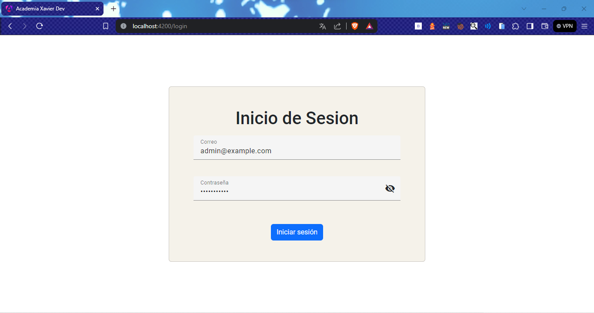
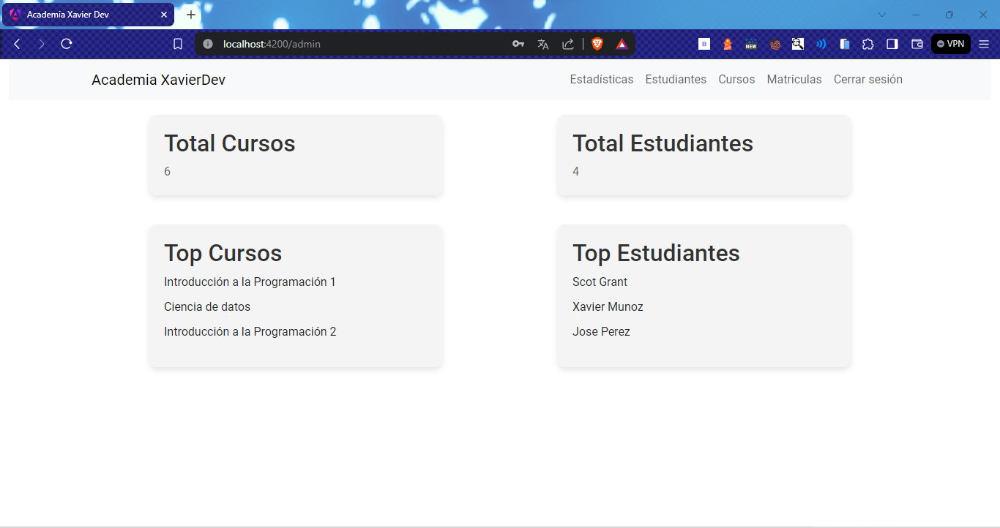
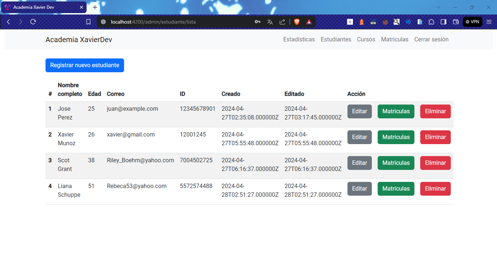
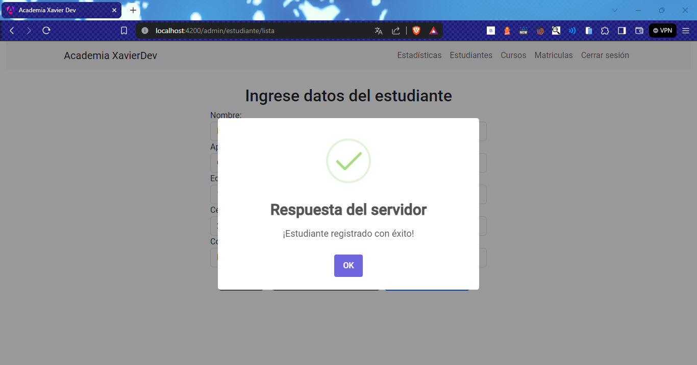
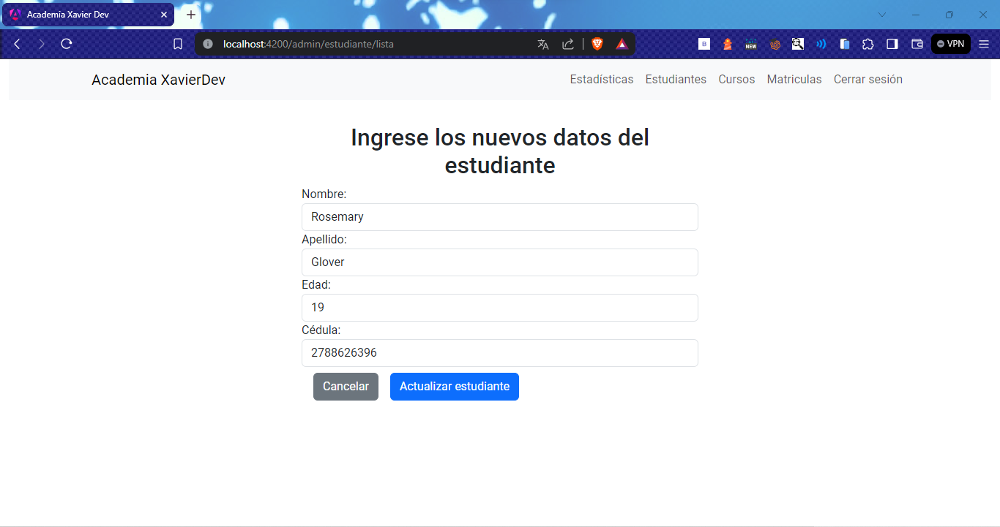
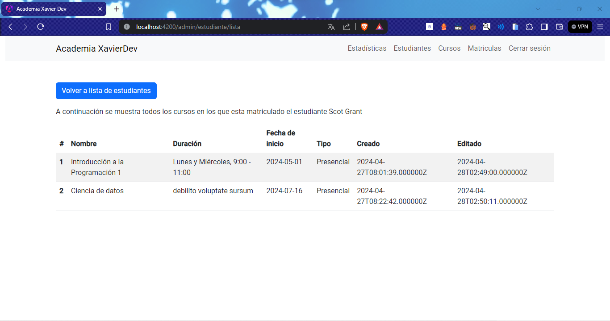
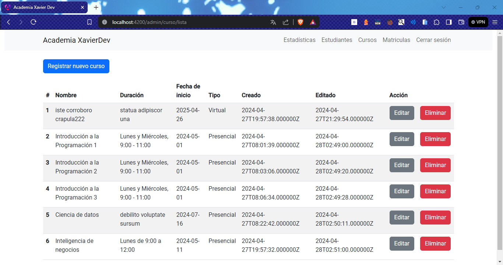
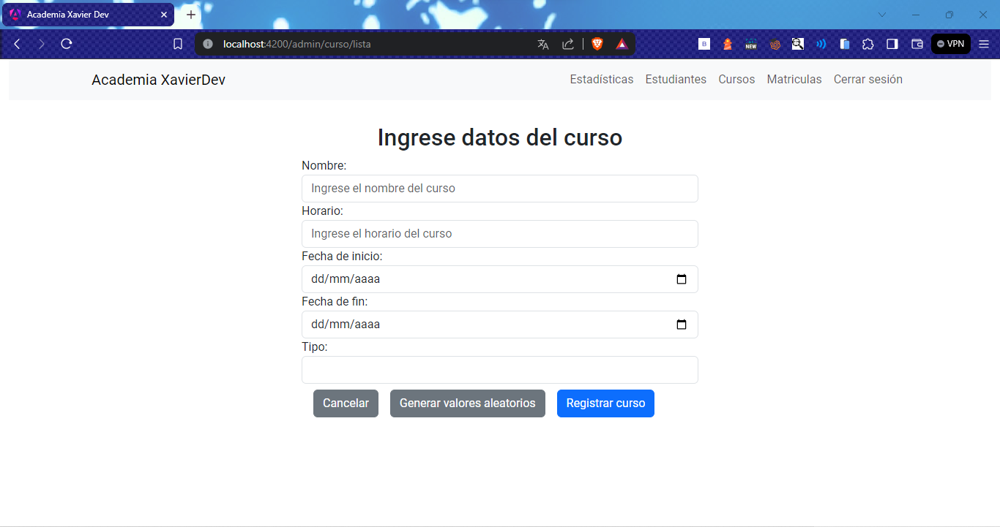

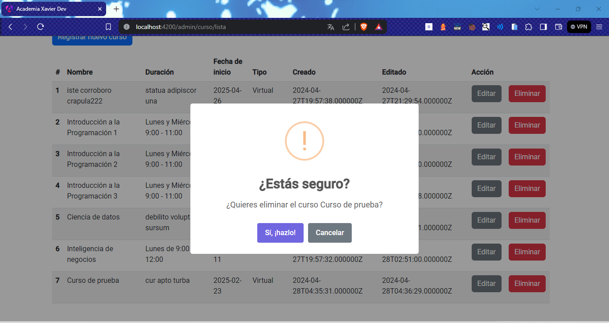
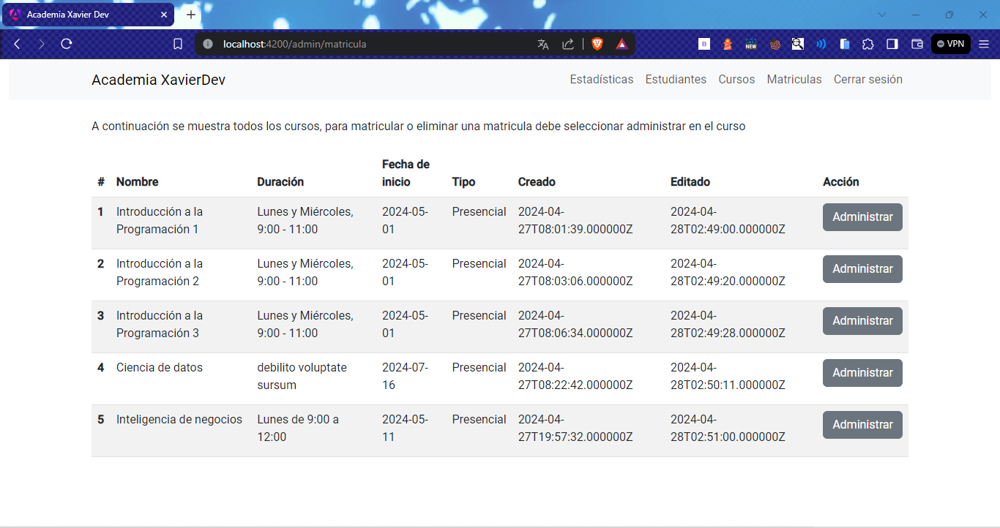
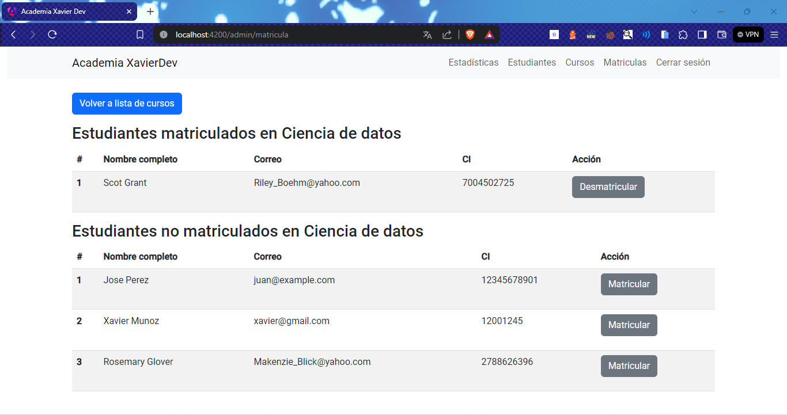

